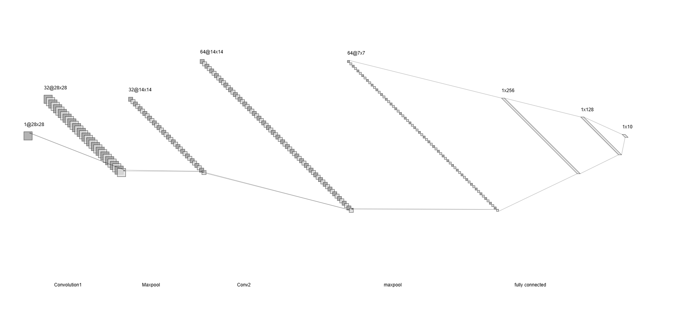
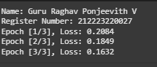
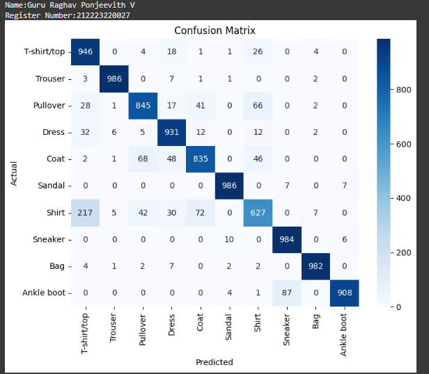
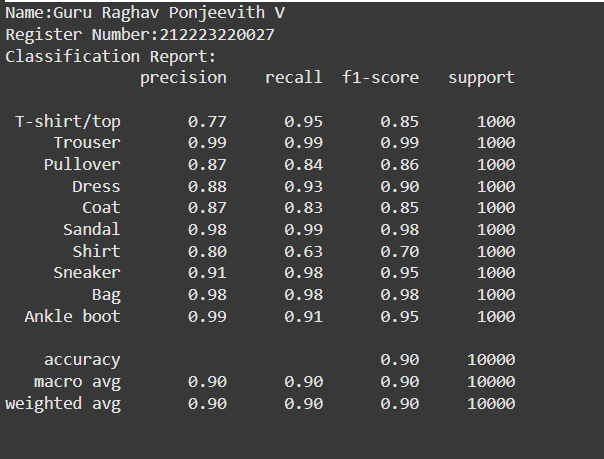
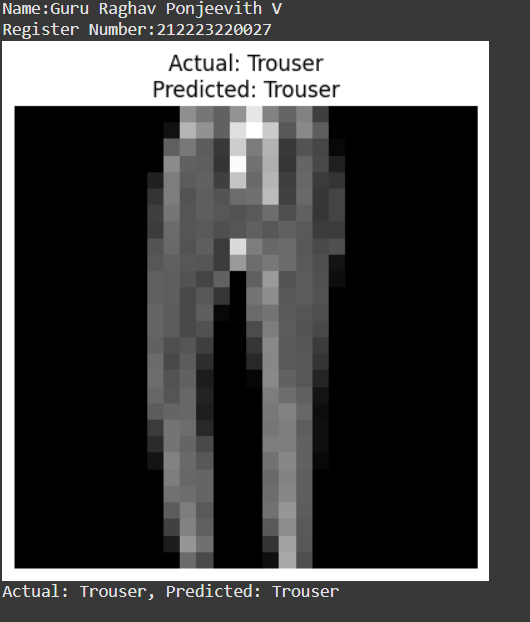

# Convolutional Deep Neural Network for Image Classification

## AIM

To Develop a convolutional deep neural network for image classification and to verify the response for new images.

## Problem Statement 
Develop a Convolutional Neural Network (CNN) to classify images into predefined categories. The dataset consists of labeled images split into training and testing sets, with preprocessing steps like resizing, normalization, and augmentation to enhance model performance. The trained model will be tested on new images to verify accuracy.


## Data set
   * Dataset: MNIST.
   * Size: 60,000 training images, 10,000 test images.
   * Image Dimensions: 28 × 28 pixels, grayscale.
   * Number of Classes: 10 (digits 0-9).
   * Preprocessing: Normalization to [0,1] range.

## Neural Network Model



## DESIGN STEPS

### STEP 1:
Import the necessary libraries such as NumPy, Matplotlib, and PyTorch.

### STEP 2:
Load and preprocess the dataset:

- Resize images to a fixed size (128×128).
- Normalize pixel values to a range between 0 and 1.
- Convert labels into numerical format if necessary.

### STEP 3:
Define the CNN Architecture, which includes:

- Input Layer: Shape (8,128,128)
- Convolutional Layer 1: 8 filters, kernel size (16×16), ReLU activation
- Max-Pooling Layer 1: Pool size (2×2)
- Convolutional Layer 2: 24 filters, kernel size (8×8), ReLU activation
- Max-Pooling Layer 2: Pool size (2×2)
- Fully Connected (Dense) Layer:
   - First Dense Layer with 256 neurons
   - Second Dense Layer with 128 neurons
   - Output Layer for classification
     
### STEP 4:
Define the loss function (e.g., Cross-Entropy Loss for classification) and optimizer (e.g., Adam or SGD).

### STEP 5:
Train the model by passing training data through the network, calculating the loss, and updating the weights using backpropagation.

### STEP 6:
Evaluate the trained model on the test dataset using accuracy, confusion matrix, and other performance metrics.

### STEP 7:
Make predictions on new images and analyze the results.


## PROGRAM

### Name:Guru Raghav Ponjeevith V
### Register Number:212223220027
```python
class CNNClassifier(nn.Module):
  def __init__(self): # Define __init__ method explicitly
    super(CNNClassifier, self).__init__() # Call super().__init__() within __init__
    self.conv1 = nn.Conv2d(in_channels=1, out_channels=32, kernel_size=3, padding=1) # Correct argument names
    self.conv2 = nn.Conv2d(in_channels=32, out_channels=64, kernel_size=3, padding=1)  # Correct argument names
    self.conv3 = nn.Conv2d(in_channels=64, out_channels=128, kernel_size=3, padding=1) # Correct argument names
    self.pool = nn.MaxPool2d(kernel_size=2, stride=2)
    self.fc1 = nn.Linear(128 * 3 * 3, 128) # Adjust input size for Linear layer (Calculation needs update if image size changed)
    self.fc2 = nn.Linear(128, 64)
    self.fc3 = nn.Linear(64, 10)

  def forward(self, x):
    x = self.pool(torch.relu(self.conv1(x))) # Correctly call self.conv1
    x = self.pool(torch.relu(self.conv2(x)))  # Correctly call self.conv2
    x = self.pool(torch.relu(self.conv3(x))) # Correctly call self.conv3
    x = x.view(x.size(0), -1) # Flatten the tensor
    x = torch.relu(self.fc1(x)) # Correctly call self.fc1
    x = torch.relu(self.fc2(x)) # Correctly call self.fc2
    x = self.fc3(x)
    return x
```

```python
# Initialize the Model, Loss Function, and Optimizer
model =CNNClassifier()
criterion =nn.CrossEntropyLoss()
optimizer =optim.Adam(model.parameters(), lr=0.001)

```

```python
# Train the Model
## Step 3: Train the Model
def train_model(model, train_loader, optimizer, criterion, num_epochs=3):
    print('Name: Guru Raghav Ponjeevith V')
    print('Register Number: 212223220027')

    for epoch in range(num_epochs):
        model.train()
        running_loss = 0.0
        
        for images, labels in train_loader:
            optimizer.zero_grad()
            outputs = model(images)
            loss = criterion(outputs, labels)
            loss.backward()
            optimizer.step()
            running_loss += loss.item()
        
        # Print only once per epoch
        avg_loss = running_loss / len(train_loader)
        print(f'Epoch [{epoch+1}/{num_epochs}], Loss: {avg_loss:.4f}')


```

## OUTPUT
### Training Loss per Epoch





### Confusion Matrix





### Classification Report





### New Sample Data Prediction





## RESULT


The CNN model was successfully trained on the MNIST dataset for 3 epochs, achieving a final loss of 0.1632, demonstrating effective handwritten digit classification.
